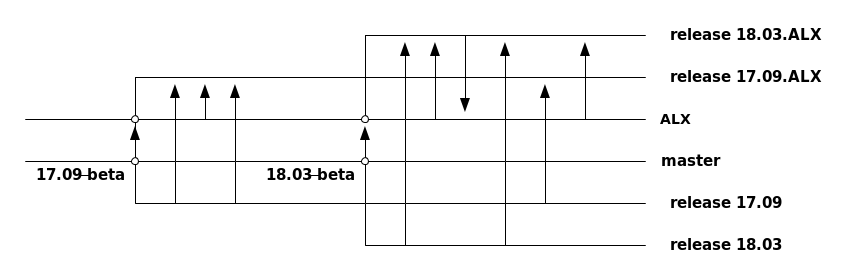

# ALX
The Agile LAN eXtender - Providing Point-to-point and multi-point L2-VPNs on top of IP

## Motivation and Overview

This repository provides the framework to create and maintain a
full-featured network appliance based on the [Snabb
Switch](https://github.com/snabbco/snabb/blob/master/README.md)
project.  The core code used by the appliance is maintained in the
[`l2vpn` branch](https://github.com/snabbco/snabb/tree/l2vpn) of the
main [Snabb repository](https://github.com/snabbco/snabb).  Please
refer to the documentation of the [`l2vpn` Snabb
program](https://github.com/snabbco/snabb/blob/l2vpn/src/program/l2vpn/README.md)
for a detailed description of the service.

The motivation for creating the `l2vpn` application in the first place
is explained in a [short
paper](https://tnc2014.terena.org/getfile/934) and a
[presentation](https://www.youtube.com/watch?v=Jbn3aNkud6Y)
([slides](https://tnc2014.terena.org/getfile/1788)) given at the
[TERENA Network Conference 2014](https://tnc2014.terena.org/).

The `l2vpn` application is fully functional on its own (possibly
augmented with [SNMP
subagents](https://github.com/alexandergall/snabb-snmp-subagent) for
SNMP support and some kind of BGP daemon to propagate the next-hop for
routing of the tunnel endpoints) on any Linux-based system.  As such,
the operator can chose any method she wants for management and
monitoring - after all, "it's just a server".  While this seems like a
desirable feature (and it might well be so in certain environments),
it doesn't work well in a very important use-case, which is as a
"network appliance" run side-by-side with traditional appliances like
routers or switches by a regular network operation center (NOC).

The typical environment in that case looks like this: the operator
buys a device from a vendor who provides both, the hardware and the
software that runs on it.  The vendor (possibly through a re-seller)
provides well-defined "releases" of their systems as well as support
for troubleshooting.  The device itself usually has its own
configuration environment (e.g. a GUI or a specialized CLI) and
provides certain standard "northbound" interfaces for remote
monitoring and management (e.g. SNMP and/or Netconf/YANG).

In particular, the operator is not bothered with the details of the
operating system that runs on the device.  From her perspective, the
interaction with it is pretty much limited to

   * configuration of actual network services, e.g. interfaces,
     routing protocols or, for that matter, L2 VPNs

   * system maintenance, e.g. upgrade of releases or configuration
     management (backup, rollbacks etc.)

This is substantially different from running a generic server, where
the operator has to deal with every minute detail of the chosen
distribution apart from running the actual service itself.  This is
the main reason why it is difficult to integrate such a system into
the work flow of a traditional NOC.

The aim of the ALX system is to turn a generic server which happens to
be running a network-centric application into an appliance that
adheres to the same operational principles as traditional network
appliances.

Key to this is the choice of the Linux distribution and how it is
presented to the user in terms of installation and maintenance.  The
following items are of particular importance

   * Precise definition of the system, i.e. an exhaustive list of
     software packages, their versions and exact specification how to
     build them, that make up the system

   * Upgrades and rollbacks to specific system configurations that can
     be treated as well-defined "releases" of the entire system

The problem with *all* well-known Linux distributions is that none of
them can truly fulfill these requirements.  For example, package
dependencies are strictly *nominal*, e.g. they refer to the *names* of
other packages (and usually version numbers) but not how exactly they
need to be built to satisfy the requirements of the package which
depends on them.  None of them can perform a true rollback to a
previous state of the system after a major upgrade of the
distribution.

This state of affairs is the reason why the ALX project has chosen the
[NixOS](https://nixos.org/) distribution as basis for packaging the
`l2vpn` application.  This distribution is based on a purely
functional approach to package management (the [Nix package
manager](https://nixos.org/nix/)), which overcomes these shortcomings.
The interested reader is referred to the
[NixOS](https://nixos.org/nixos/manual/) and
[Nix](http://nixos.org/nix/manual/) manuals as well as the main
author's [PhD thesis](http://nixos.org/~eelco/pubs/phd-thesis.pdf) for
details.

One of the most important aspects of Nix/NixOS is the purely
declarative style of describing a particular system configuration
through an expression in a specialized (domain-specific) functional
programming language (the *Nix expression language*).  This expression
states how exactly every single piece of software that will make up
the system is to be built from source code, which makes it perfect to
use as the very definition of a specific release of the system (in
practice, a *binary cache* of pre-built packages is used to avoid
having to actually build everything from source).

It is not only the definition of packages which is purely declarative
but the entire system configuration, e.g. the configuration of all the
services, user accounts, settings etc.  This makes it possible to
replicate any system *precisely* by supplying the Nix expressions for
the packages and the configuration.

This is essentially all that is to the ALX system as such.  The
present Git repository contains a
[fork](https://github.com/alexandergall/ALX) of the [official NixOS
source distribution](https://github.com/NixOS/nixpkgs) as a submodule.
This fork contains the descriptions how to build the `l2vpn`-specific
components as well as some NixOS modules that allow configuration of
the entire system purely through Nix expressions.

The repository also contains a facility that provides a
fully-automated PXE-based installer to set up a system from scratch.

## Versioning

### NixOS standard versioning

NixOS uses version numbers in the format `<major>.<minor>.<commit>`
for its [official releases](https://nixos.org/releases/nixos/), for
example `16.03.659.011ea84`. `<major>` itself is of the form
`<year>.<month>`.  There are two major releases per year, one in March
(month `03`) and the other in September (month `09`), which are
denoted as stable releases.

The [`nixpkgs` Git repository](https://github.com/NixOS/nixpkgs)
contains a branch for each stable release called `release-<major>`,
e.g. `release-16.03`.  The branch point on `master` is marked by the
tag `<major>-beta`.  When the beta phase has ended, that particular
commit on the release branch is marked with the tag `<major>` and the
release is declared to be stable.  The `<minor>` number counts the
number of commits from an arbitrary starting point and simply serves
as a way to distinguish new releases by a monotonically increasing
number. Up to 18.03, this starting point was chosen to be the commit
of the release tag itself, i.e. `<minor>` started at 0 with the first
release.  This convention was dropped with 18.03 and `<minor>` now
simply counts the total number of commits reachable from the release
tag all the way back to the start of the repository.

Finally, `<commit>` is the abbreviated Git commit from which the
release was created.

### ALX Maintenance and Versioning

In essence, ALX is a plain NixOS release with a few custom
modifications.  We refer to this as a *branded NixOS*, though this
nomenclature is not used by the NixOS community.

The ALX-branded NixOS supplies its own *channel*, which is used to
track versions of the system configuration and software packages.  A
channel is a mechanism defined in the NixOS ecosystem that distributes
the description of an entire system by means of a "Nix expression" and
its associated binaries (available from a *binary cache*).

The customizations for ALX are kept on [a separate branch in a fork of
the official `nixpkgs`
repository](https://github.com/alexandergall/nixpkgs/tree/ALX), which
is kept in sync with the master branch as detailed below.

Just like the ALX branch keeps track of the master branch, there are
ALX-specific release branches called `release-<major>.ALX` that keep
track of their generic counterparts `release-<major>`. ALX releases
are always created on a ALX-specific release branch.

The following graphic illustrates the structure of branches and merges
for two release branches.  Circles and arrows denote branch points and
Git tags and merges, respectively.



The workflow is as follows.

The ALX branch is synchronized with the upstream `nixpkgs` master
branch whenever a new stable NixOS release is generated, i.e. when the
NixOS maintainers create the `<major>` tag on the new release branch.
At that point, the ALX maintainer performs the following steps.

   * Merge the tag `<major>-beta` into ALX (the branch
     `release-<major>` has already been created by the NixOS
     maintainers)

   * Update `.version` to contain `<major>.ALX`

   * Create the tag `<major>.ALX-base`

   * Create a new branch `release-<major>.ALX` and switch to it with
     `git checkout -b release-<major>.ALX`

   * Merge the current NixOS release branch `release-<major>` from any
     commit following the `<major>` tag

From this point on, the branch `release-<major>.ALX` receives updates
exclusively from the ALX and `release-<major>` branches.  The former
tracks modifications to the ALX customizations, the latter tracks
updates of the regular NixOS release which are relevant for ALX.
Alternatively, ALX-specific changes can also be applied to
`release-<major>.ALX` and then cherry-picked to ALX.

Merges from the ALX branch into any older ALX release branch are no
longer possible after the `<major>.ALX-base` tag due to the Git
workflow used in the `nixpkgs` repository, which makes extensive use
of cherry-picking from the master to release branches.  For the same
reason, the ALX branch receives no merges from the master until the
next NixOS release (the merges would create conflicts when propagated
to the `release-<major>.ALX` branch).

In other words, only the newest ALX release branch receives updates of
the ALX customizations. Older ALX release branches may still receive
critical updates from their corresponding NixOS release branches.

ALX version numbers are constructed exactly like those of regular
NixOS releases with the exception of an additional label `ALX` after
the major version, e.g. `18.03.ALX.1234.abcdef`.

### ALX releases

Releases are created from this repository.  It contains the
[ALX-branded NixOS
repository](https://github.com/alexandergall/nixpkgs) and the [fully
automated NixOS installer
repository](https://github.com/alexandergall/nixos-pxe-installer) as
Git submodules.  Its purpose is to either build an image of a ALX
system for new installations or a command to upgrade an existing ALX
system to a newer version as described below.

A new ALX release is essentially just an upgrade of the ALX-branded
`nixpkgs` submodule.  Releases are prepared on the `master` branch as
follows.

   * If this is the first release from a new release branch, update
     the `branch` of `nixpkgs` in `.gitmodules`

   * In the `nixpkgs` submodule, checkout the commit that will make up
     this ALX release.

   * Add a file to the directory `release-notes` describing the key
     features of the new release.  The name of the file should be the
     exact version number of the release.  The version can be
     determined by executing `cat $(nix-build -A versionALX --quiet)`.

   * Change to the `release` branch

   * Merge with `master`

   * Execute `nix-build`

## System requirements

   * x86-64 architecture, recommended is an Intel Haswell CPU or newer
     for applications requiring high packet rates (>500k pps)
   * The following NICs are supported
     * 1GE
       * Intel 350
       * Intel 210
     * 10GE
       * Intel 82599 SFP
       * Intel 82574L
       * Intel 82571
       * Intel 82599 T3
       * Intel X540
       * Intel X520
   * UEFI firmware for installation via PXE

## Restrictions

Only IPv6 is supported as transport protocol for encapsulated Ethernet
frames, i.e. IPv6 connectivity is required between the endpoints of
any pseudowire.

## Downloads

The official releases of the ALX system built with default settings
are [available for download](http://alx.net.switch.ch/releases/) as is
a [generic installer](http://alx.net.switch.ch/installer/) for any
kind of NixOS system.

These downloads are automatically created by a [continuous integration
system](http://hydra.net.switch.ch/) (CI) based on
[Hydra](https://nixos.org/hydra/).

## <a name="building"></a>Building

The system as well as the generic installer can be created on any
NixOS system (note that running nixpkgs on a standard Linux
distribution as described, for example,
[here](https://nixos.org/wiki/Installing_Nix_on_Debian), is not
enough).

### Installer

To build the generic installer, clone into the `installer` branch of
https://github.com/alexandergall/ALX.git

```
$ git clone --recursive -b installer https://github.com/alexandergall/ALX.git
```

and execute

```
$ nix-build
```

To customize the installer, copy `installer-config.template.nix` to
`installer-config.nix` and apply the desired configuration options
before calling `nix-build`.  Please refer to [the documentation of the
installer
module](https://github.com/alexandergall/nixos-pxe-installer/blob/master/README.md),
in particular to the sections [Setting up the
installer](https://github.com/alexandergall/nixos-pxe-installer/blob/master/README.md#setting-up-the-installer)
and [Module
configuration](https://github.com/alexandergall/nixos-pxe-installer/blob/master/README.md#module-configuration-1)
for details.

### <a name="buildingALX"></a>ALX

To build the latest ALX release, clone into the `release` branch of https://github.com/alexandergall/ALX.git

```
$ git clone --recursive -b release https://github.com/alexandergall/ALX.git
```

To build the command needed for upgrading an existing ALX installation to the new version execute

```
$ nix-build -A upgradeCommand
[output suppressed]
building '/nix/store/s47hkpb1ska1zl6qs22jfxq5abv4p742-nixos-18.03.ALX.133196.ffd688926ee.drv'...
/nix/store/k56cs8k1znplfa4fbnhcsb5jb66bg7ma-nixos-18.03.ALX.133196.ffd688926ee
```

This creates a store path (a directory in `/nix/store` containing the
result of the build) which contains a shell script and the release notes

```
$ ls -l /nix/store/k56cs8k1znplfa4fbnhcsb5jb66bg7ma-nixos-18.03.ALX.133196.ffd688926ee
total 10088
-r-xr-xr-x 1 root root 10322200 Jan  1  1970 alx-upgrade
-r--r--r-- 1 root root      193 Jan  1  1970 release-notes.txt
```

The shell-sctip `alx-upgrade` can be executed on the appliance to
[upgrade it to this release](#upgrading)

To build the files needed for an automated installation of a new system, execute

```
$ nix-build -A installImage -A installConfig
[output suppressed]
/nix/store/lwjr3l9qa204kffl28rx1n3yrj57lmy7-install-tarball-nixos-18.03.ALX.133196.ffd688926ee
/nix/store/26bakcd6si5fkkw249lb01w44yj88zly-install-config
```

The resulting files are used to [install a system from
scratch](#installFromScratch).

The Snabb-specific manpage describing the NixOS configuration options
can be obtained by

```
$ nix-build module-manpage.nix -A snabb && man result/share/man/man5/configuration.nix.5
```

## Bootstrapping

There are a number of ways to get an initial installation deployed on
a system.

### <a name="installFromExistingNixOS"></a>From an existing NixOS installation

If the target system is already running NixOS, it can be transformed
into an ALX system as follows.

   * Remove the existing `nixos` channel

     ```
     # nix-channel --remove nixos
     ```
   * Add the "branded" ALX `nixos` channel

     ```
     # nix-channel --add file:///ALX/channels/nixos-ALX nixos
     ```
   * Merge `/etc/nixos` with the contents of the `nixos-config` directory of the
     ALX Git repository
   * Proceed as for an [upgrade](#upgrading). In this case, the upgrade command
     will fail with an error saying that `nixpkgs not available, can't compare
     versions.  Use -f to force installation`.  This is because
     `nix-channel --remove nixos` has effectively removed the nixpkgs sources
     from the standard search path (`NIX_PATH`).  Use `alx-upgrade -f` to
     force the upgrade as instructed.

### <a name="installFromScratch"></a>From scratch

If the target system has no operating system installed yet or if the
existing system should be overwritten by ALX, you have the choice of
performing a fully automated install of the ALX system directly or to
go through a standard NixOS installation first.

Once the system is installed, it is only accessible via the serial
console by logging in as `root` with password `root` (assuming the
standard NixOS configuration from the `nixos-config` directory of the
ALX Git repository was used to generate the install image).

#### Fully automated install

To perform a fully automated installation, either [build the installer
and ALX install image yourself](#building) or get the following files

   * From http://alx.net.switch.ch/installer/
      * `boot-loader.tar.xz`
      * `nfsroot.tar.xz`
   * From http://alx.net.switch.ch/releases/latest/
      * `nixos.tar.gz`
      * `config`

Set up DHCP, TFP and NFS servers as described in the [installer
instructions](https://github.com/alexandergall/nixos-pxe-installer/blob/master/README.md#configuring).

Then [stage the install image and
configuration](https://github.com/alexandergall/nixos-pxe-installer/blob/master/README.md#staging)
by copying `nixos.tar.gz` and `config` into the `installer` directory
of the NFS root file system and creating a symbolic link `nixos-image`
pointing to `nixos.tar.gz`, e.g. assuming the root file system is
located at `/srv/nixos/nfsroot`

```
# cp /path-to/nixos.tar.gz /src/nixos/nfsroot/installer
# cp /path-to/config /src/nixos/nfsroot/installer
# ln -s ./nixos.tar.gz /srv/nixos/nfsroot/installer/nixos-image
```

The system will be installed after performing a PXE network boot off
the DHCP configuration.

#### Via a standard NixOS installation

Please refer to the [standard method for installing a fresh NixOS
system](https://nixos.org/nixos/download.html).  Note that this
currently involves some manual steps.  Once the system is up and
running, proceed as described in the procedure for [converting an
existing NixOS system](#installFromExistingNixOS)

## <a name="upgrading"></a>Upgrading

To upgrade an existing ALX installation to a new version, either
download the file `alx-upgrade` from the directory of the desired
target version on http://alx.net.switch.ch/releases/ (or
http://alx.net.switch.ch/releases/latest for the most recent release)
or [build it yourself](#buildingALX) then copy it to an arbitrary
location on the system that should be upgraded.

The file is a shell script that contains a self-extracting archive of
the ALX-branded NixOS "channel" which, in turn, contains the Nix
expression that describes the components of the ALX system
corresponding to the new version.  The upgrade process essentially
performs an update of the channel via `nix-channel --update` followed
by `nixos-rebuild switch` to build the new system configuration and
make it the default boot environment.

Note that the upgrade command only contains the Nix expression of the
system, not any software packages.  Actual packages are fetched from
the binary cache or built from source when `nixos-rebuild` is executed.

To check the versions of the current system and the one contained in
the upgrade, execute

```
$ ./alx-upgrade -i
```

To perform the actual upgrade, execute

```
# ./alx-upgrade
```

as root.  To force an "upgrade" to a version that is actually lower
than the currently installed version, use

```
# ./alx-upgrade -f
```

To perform a rollback to the previous version, execute

```
# nix-env -p /nix/var/nix/profiles/per-user/root/channels --rollback
```

## Configuration

The system is configured exclusively through the Nix expressions
imported by `/etc/nixos/configuration.nix` (other files are included
via the `imports` list).

The configuration is strictly declarative, which means that the entire
system state is constructed from these expressions alone and does not
depend on any other inputs.  As a consequence, the system can be
reproduced exactly by installing the given ALX channel together with
the contents of `/etc/nixos`.

For convenience, the configuration is split up into separate files,
which are imported by `/etc/nixos/configuration.nix`.  The following
sections cover each of these files.

Editing the configuration has no direct effect.  A configuration is
activated by executing `nixos-rebuild` (as root).  Refer to the
`nixos-rebuild(8)` man page for a description of available options and
arguments.

The system can be rolled back to the previous configuration by using
the `--rollback` switch.  Note that this will not revert any changes
made to the configuration in `/etc/nixos`.  Please use the version
control system of your choice to track the changes in those files.

### `system.nix`

This file covers system-related configuration items like kernel
options, boot loader settings and basic service configurations.

The default `system.nix` contains the following options

```
  ## Activate serial console
  boot.kernelParams = [ "console=ttyS0,115200n8" ];

  ## Use the gummiboot efi boot loader.
  boot.loader.gummiboot.enable = true;
  boot.loader.efi.canTouchEfiVariables = true;

  ## Enable EFI support for grub2 package
  boot.loader.grub.efiSupport = true;

  time.timeZone = "Europe/Zurich";

  services.openssh.enable = true;
  services.ntp.servers = [ "pool.ntp.org" ];

  environment.systemPackages = with pkgs; [
     emacs24-nox config.services.snabb.pkg exabgp
  ];

```

### `users.nix`

The `users.nix` file contains all settings related to user management.
Per default, it contains

```
 users.mutableUsers = false;
 users.extraUsers.root.hashedPassword = "$6$cSUnFL6MbD34$BaS0NLN1KCddegCaTKDMCc1D21Pdge9gFz5tr65U0KgNOgtrEoAGuVnelaPIuEb7iC0FOWE7HUG6NV2b2yN8s/";
```

The `mutableUsers` option is important to keep the configuration
strictly declarative, which means that the user databases
(`/etc/passwd`, `/etc/group` etc.) are exclusively managed by NixOS.
To maintain this paradigm, the operator *must not* use any of the
standard commands (`useradd`, `usermod` etc.) directly.  This is
enforced by excluding those commands from the system environment
(i.e. search path).

To add an account, use something like

```
  users.extraUsers.foo = {
    isNormalUser = true;
    openssh.authorizedKeys.keys = [ "ssh-dss AAAAB3NzaC1k..." ];
  };
```

See the section about the `user` configuration option in the
`configuration.nix(5)` man page for details.

### `networking`

The `networking` directory contains two files.

#### `default.nix`

This file imports `./interfaces.nix` and sets some generic (non
interface-specific) networking options.  Per default, it enables the
built-in firewall, allowing only ICMP echo requests

```
  networking.firewall = {
    enable = true;
    allowPing = true;
  };
```

#### `interfaces.nix`

This file contains all interface-specific configurations.  Per
default, it enables DHCP on all interfaces

```
  networking.useDHCP = true;
```

To create a static configuration for an interface named `eth0`, one
could use

```
  networking = {
    interfaces.eth0.ip4 = [ {
      address = "192.0.2.2";
      prefixLength = 24;
    } ];

    useDHCP = false;
    defaultGateway = "192.0.2.1";
    nameservers = [  "192.0.2.1" ];
  };
```

See the section about the `networking` configuration option in the
`configuration.nix(5)` man page for details.

### <a name="snmpd.nix">`snmpd.nix`</a>

This file contains the configuration of the SNMP daemon from the
`net-snmp` package.  The default `snmpd.nix` enables the SNMP daemon
by setting

```
services.snmpd.enable = true;
```

If this option is set to `false`, neither the SNMP daemon itself nor
any of the sub-agents will be started.

If enabled, the relevant section for the configuration is the
following:

```
    listenOn = {
      ipv4 = [ "127.0.0.1" ];
      ipv6 = [ "::1" ];
    };
    roCommunities = {
      public = {
        sources4 = [ "127.0.0.1" ];
        sources6 = [ "::1" ];
      };
    };
```

By default, the daemon only listens on `localhost` and allows read
access to the entire OID tree with community `public` from
`localhost`.  To allow remote read access, add the local addresses to
the lists in the `listenOn` section and either add remote scopes to
the `public` community or add a community of your choice, e.g.

```
    listenOn = {
      ipv4 = [ "127.0.0.1" "192.0.2.1];
      ipv6 = [ "::1" "2001:db8:0:1::1" ];
    };
    roCommunities = {
      public = {
        sources4 = [ "127.0.0.1" ];
        sources6 = [ "::1" ];
      };
      foo = {
        sources4 = [ "198.51.100.0/24" ];
        sources6 = [ "::/0" ];
      };
    };
```

### `bgp.nix`

The system includes the `exaBGP` daemon to advertise the VPN IPv6
endpoint addresses to the network.  By default, the daemon is disabled

```
  services.exabgp.enable = false;
```

To make use of this feature, enable the daemon and configure at least
one BGP peer.  The configuration includes only the setup of the
sessions.  Advertisement of reachability information is performed
automatically when the `l2vpn` service is enabled.

See the section about the `exabgp` configuration option in the
`configuration.nix(5)` man page for a description of all available
options.  The following examples treat two of the most common cases.

#### External BGP

In this configuration, the host is assigned its own AS number, usually
from the private range 64512-65534 and establishes a eBGP session with
one (or more) adjacent routers in the "core" AS:

```
  services.exabgp = {
    enable = true;
    routerID = "192.0.2.1";
    neighbors = [
      localAddress = "192.0.2.1";
      remoteAddress = "198.51.100.1";
      localAS = 64512;
      remoteAS = 64496;
      addressFamilies = [
        { afi = "ipv6"; safi = "unicast"; }
      ];
      md5 = "skjfsiowHIUHDljd";
    ];
  };
```

#### Internal BGP

In this configuration, the host is part of the core AS.  We assume
that the core AS uses route-reflectors in its iBGP mesh.  The host
establishes iBGP sessions to each route-reflector, e.g.

```
  services.exabgp =  let
    localAddress = "192.0.2.1";
    config = {
      inherit localAddress;
      localAS = 64496;
      remoteAS = 64496;
      addressFamilies = [
        { afi = "ipv6"; safi = "unicast"; }
      ];
      md5 = "skjfsiowHIUHDljd";
    };
    mkNeighbors = neighbors:
      map (n: { remoteAddress = "${n}"; } // config) neighbors;
  in {
    enable = true;
    routerID = localAddress;
    neighbors = mkNeighbors [
      "198.51.100.1"
      "198.51.100.2"
      "198.51.100.3"
    ];
  };
```

### `l2vpn.nix`

This file contains the configuration of the actual L2VPN service.  The
full set of available options of the `services.snabb` NixOS module is
part of the man page for `configuration.nix(5)`.  An excerpt
containing only the Snabb-specific options can be found in the section
[Snabb NixOS Options](#nixos-options).

The structure of the configuration is very similar to that of the the
[`l2vpn` program](https://github.com/snabbco/snabb/blob/l2vpn-v4/src/program/l2vpn/README.md#configuration).

By default, the Snabb service it is enabled but contains no interface
or VPN definitions

```
  services.snabb = {
    enable = true;
    interfaces = [];
    programs.l2vpn.instances = {};
  };
```

The configuration of interfaces differs significantly from that of the
`l2vpn` program itself and is described in the following section.

#### Device Selection and Interface configuration

The configuration of physical interfaces is logically split into two
sections.  One section assigns a globally unique name to each physical
interface and provides the specifics of its low-level configuration,
i.e. the PCI address and Snabb driver selection.

The second section provides the high-level configuration of the
interface, i.e. its properties at the link and network layers (L2/L3).

Since the low-level configuration clearly depends on features of the
hardware, it is convenient to structure it in such a manner that it
can be easily tied to specific device configurations.  The Snabb NixOS
module provides the `services.snabb.devices` option for precisely this
purpose.  The option is a two-level attribute set, where the first
level represents the name of a vendor and the second level a
particular model for this vendor.  The model contains a description of
all interfaces available on that particular device.  Consider the
following example:

```
{
  advantech = {
    FWA3230A = {
      interfaces = [
        {
          name = "GigE1/0";
          nicConfig = {
            pciAddress = "0000:0c:00.0";
            driver = {
              path = "apps.intel.intel1g";
              name = "Intel1g";
            };
          };
        }
        {
          name = "TenGigE1/1";
          nicConfig = {
            pciAddress = "0000:03:00.0";
            driver = {
              path = "apps.intel.intel_app";
              name = "Intel82599";
            };
          };
        }
      ];
    };
  };
}
```

This defines a vendor named `advantech` with a single model called
`FWA3230A`.  The device has two interfaces at PCI addresses
`0000:0c:00.0` and `0000:03:00.0`, respectively, which need to be
handled by the drivers specified by `path` and `name`.

To select this model as the active model for a ALX instance, the
following `enable` clause is added to the `services.snabb`
configuration:

```
  services.snabb = {
    enable = true;
    devices.advantech.FWA3230A.enable = true;
    interfaces = [];
    programs.l2vpn.instances = {};
  };
```

We can now proceed to add the high-level configurations of these
interfaces, for example:

```
  services.snabb = {
    enable = true;
    devices.advantech.FWA3230A.enable = true;
    interfaces = [
      {
        name = "TenGigE1/1";
        description = "Uplink";
        mtu = 9014;
        addressFamilies = {
          ipv6 = {
            address = "2001:db8:0:1::2";
            nextHop = "2001:db8:0:1::1";
          };
        };
      }
      {
        name = "GigE1/0";
        description = "Attachment Circuit VLAN trunk";
        mtu = 1518;
        trunk = {
          enable = true;
          encapsulation = "dot1q";
          vlans = [
            {
              vid = 100;
              description = "AC1";
            }
            {
              vid = 200;
              description = "AC2";
            }
          ];
        };
      }
    ];
    programs.l2vpn.instances = {};
  };
```

The `name` here must match _exactly_ that of the definitions in the
vendor/model section.

Interface `TenGigE1/1` is configured as a physical L3-port, while
`GigE1/0` is configured as a L2 trunk-port with two sub-interfaces
called `GigE1/0.100` and `GigE1/0.200` (the names are derived
automatically from the name of the underlying physical interface and
the VLAN ID, joined by a dot) on VLANs 100 and and 200, respectively.

A regular ALX distribution contains a set of pre-defined devices,
Apart from the interface definitions, these modules may also be used
to include arbitrary system configurations specific to that device.
For example, the `advantech` module
`/etc/nixos/devices/advantech/default.nix` imports the module
`classes.nix` (located in the same directory), which looks like this:

```
{ config, pkgs, lib, ... }:

with lib;
with (import ../../../../lib/devices.nix lib);

let
  activeModel = findActiveModel config.services.snabb.devices;
in
{
  imports = [ ./lcd4linux.nix ];

  config = mkIf (elem "FWA32xx" activeModel.modelSet.classes) {
    services.lcd4linux = {
      enable = true;
    };
  };
}
```

It makes use of an optional attribute of a model called `classes`,
which is just a list of arbitrary strings that is used to express some
kind of common properties among related modules.  For example, the
models `FWA3230A` and `FWA3270A` of the vendor Advantech are identical
to some extent, which is expressed by assigning both to the class
called `FWA32xx`.  The `classes.nix` module checks if the currently
selected module is a member of this class and, if so, activates the
`lcd4linux` system service, which is common to both models.

#### Immediate Driver Configuration

It is possible specify the low-level configuration in the high-level
section itself by adding the same `nicConfig` option that would appear
in the vendor/model configuration.  This is called _immediate
configuration_.  The following definition is exactly equivalent to the
split configuration in the example above (note the absence of
`devices.advantech.FWA3230A.enable = true`, which defaults to `false`)

```
  services.snabb = {
    enable = true;
    interfaces = [
      {
        name = "TenGigE1/1";
        nicConfig = {
          pciAddress = "0000:03:00.0";
          driver = {
            path = "apps.intel.intel_app";
            name = "Intel82599";
          };
        };
        description = "Uplink";
        mtu = 9014;
        addressFamilies = {
          ipv6 = {
            address = "2001:db8:0:1::2";
            nextHop = "2001:db8:0:1::1";
          };
        };
      }
      {
        name = "GigE1/0";
        nicConfig = {
          pciAddress = "0000:0c:00.0";
          driver = {
            path = "apps.intel.intel1g";
            name = "Intel1g";
          };
        };
        description = "Attachment Circuit VLAN trunk";
        mtu = 1518;
        trunk = {
          enable = true;
          encapsulation = "dot1q";
          vlans = [
            {
              vid = 100;
              description = "AC1";
            }
            {
              vid = 200;
              description = "AC2";
            }
          ];
        };
      }
    ];
    programs.l2vpn.instances = {};
  };
```

In this case, no reference to the vendor/module configuration will be
made.

This method is particularly useful to define software interfaces.  For
example, the following connects to a Linux `tap` device:

```
services.snabb = {
  enable = true;
  interfaces = [
    rec {
      name = "Tap1";
      nicConfig = {
        path = "apps.tap.tap";
        name = "Tap";
        literalConfig = ''
          { name = "${name}",
            mtu2 = ${toString (if trunk.enable then
                                  sub mtu 18
                               else
                                  sub mtu 14)} }

         '';
      };
      mtu = 1514;
      trunk.enable = false;
    }
  ];
}
```

For this to make sense, one needs to create the tap device first, e.g.
```
# ip tuntap add Tap1 mode tap
# ip link set up dev Tap1
# ip link set address 01:02:03:04:05:06 dev Tap1
# ip addr add 192.168.1.11/24 dev Tap1
```

The `mtu2` option is special for the `app.tap.tap` because the Linux
kernel does not include the Ethernet header in the MTU but the `l2vpn`
program does.  The system automatically provides the MTU configured
with the `mtu` option (1514 in this case) to the driver, but the
driver doesn't know the actual Ethernet overhead (there could be a
VLAN on top of it), so it needs to be told what the effective MTU us.

#### SNMP

For SNMP to be available in general, the SNMP daemon must be enabled
as described in the section about the [`snmpd.nix`](#snmpd.nix)
configuration file.

If the daemon is enabled, the `l2vpn` program unconditionally provides
the [SNMP MIBs for the
pseudowires](https://github.com/snabbco/snabb/blob/l2vpn/src/program/l2vpn/README.md#snmp)
by starting the corresponding SNMP sub-agent as a `systemd` service
called `pseudowire-snmp-subagent.service`.

Support for interface-related MIBs must be enabled separately by setting

```
services.snabb.snmp.enable = true;
```

This will start an SNMP sub-agent which will provide the data for the
`ifTable` and `ifXTable` SNMP tables through a `systemd` service
called `interface-snmp-subagent.service`.

The `l2vpn` program interacts with the sub-agent through a set of
shared memory segments, which is located by default in the directory
`/var/lib/snabb/shmem`.  This location can be changed through the
option `services.snabb.shmemDir`, e.g.

```
services.snabb.shmemDir = "/tmp";
```

#### VPN Instance Configuration

The VPN instances are configured in the attribute set
`services.snabb.programs.l2vpn.instances`.  The structure is basically
the same as the [literal configuration in
Lua](https://github.com/snabbco/snabb/blob/l2vpn/src/program/l2vpn/README.md#vpls-instance-configuration).

The translation of the [point-to-point
example](https://github.com/snabbco/snabb/blob/l2vpn/src/program/l2vpn/README.md#point-to-point-vpn)
into the configuration of the `l2vpn.nix` module would look as follows

Endpoint A:

```
services.snabb = {
  enable = true;
  snmp.enable = true;
  devices.advantech.FWA3320A.enable = true;
  interfaces = [
    {
      name = "TenGigE0/1";
      description = "uplink";
      mtu = 9206;
      addressFamilies = {
        ipv6 = {
          address = "2001:db8:0:C101:0:0:0:2";
          nextHop = "2001:db8:0:C101:0:0:0:1";
        };
      };
    }
    {
      name = "TenGigE0/0";
      description = "AC";
      mtu = 1514;
    }
  ];

  programs.l2vpn.instances = {
    vpn1 = {
      enable = true;
      uplink = "TenGigE0/1";
      vpls = {
        myvpn = {
          description = "Endpoint A of a point-to-point L2 VPN";
          mtu = 1514;
          vcID = 1;
          address = "2001:db8:0:1:0:0:0:1";
          attachmentCircuits = {
            ac_A = "TenGigE0/0";
          };
          defaultTunnel = {
            type = "l2tpv3";
            config.l2tpv3 = { 
              localCookie = "\\x00\\x11\\x22\\x33\\x44\\x55\\x66\\x77";
              remoteCookie = "\\x77\\x66\\x55\\x44\\x33\\x33\\x11\\x00";
            };
          };
          defaultControlChannel = {
            heartbeat = 2;
            deadFactor = 4;
          };
          pseudowires = {
            pw_B = {
              address = "2001:db8:0:1:0:0:0:2";
            };
          };
        };
      };
    };
  };
};

```

Endpoint B:

```
services.snabb = {
  enable = true;
  snmp.enable = true;
  interfaces = [
    {
      name = "TenGigE0/1";
      description = "uplink";
      mtu = 9206;
      addressFamilies = {
        ipv6 = {
          address = "2001:db8:0:C102:0:0:0:2";
          nextHop = "2001:db8:0:C102:0:0:0:1";
        };
      };
    }
    {
      name = "TenGigE0/0";
      description = "AC";
      mtu = 1514;
    }
  ];

  programs.l2vpn.instances = {
    vpn1 = {
      enable = true;
      uplink = "TenGigE0/1";
      vpls = {
        myvpn = {
          description = "Endpoint B of a point-to-point L2 VPN";
          mtu = 1514;
          vcID = 1;
          address = "2001:db8:0:1:0:0:0:2";
          attachmentCircuits = {
            ac_A = "TenGigE0/0";
          };
          defaultTunnel = {
            type = "l2tpv3";
            config.l2tpv3 = { 
              localCookie = "\\x77\\x66\\x55\\x44\\x33\\x33\\x11\\x00";
              remoteCookie = "\\x00\\x11\\x22\\x33\\x44\\x55\\x66\\x77";
            };
          };
          defaultControlChannel = {
            heartbeat = 2;
            deadFactor = 4;
          };
          pseudowires = {
            pw_A = {
              address = "2001:db8:0:1:0:0:0:1";
            };
          };
        };
      };
    };
  };
};

```

## Hacking

### `l2vpn` Program

To run a modified version of the `l2vpn` application, you can replace
the standard version provided by the system as follows.

First, create a local copy of the Snabb repository, e.g.

```
$  pwd
/home/gall
$ git clone https://github.com/snabbco/snabb
Cloning into 'snabb'...
remote: Counting objects: 19556, done.
remote: Compressing objects: 100% (21/21), done.
remote: Total 19556 (delta 7), reused 0 (delta 0), pack-reused 19535
Receiving objects: 100% (19556/19556), 7.23 MiB | 3.59 MiB/s, done.
Resolving deltas: 100% (12986/12986), done.
Checking connectivity... done.
$ cd snabb
$ git checkout l2vpn
Branch l2vpn set up to track remote branch l2vpn from origin.
Switched to a new branch 'l2vpn'
```

Then create an override of the standard package by adding the Nix
expression (replacing `src` with your actual path, of course)

```
  nixpkgs.config.packageOverrides = pkgs: rec {
   snabbL2VPN = pkgs.snabbL2VPN.overrideDerivation (oldAttrs: {
     src = /home/gall/snabb;
   });
  };
```

to the configuration in `/etc/nixos`, for example in `/etc/nixos/l2vpn.nix`:

```
{ config, pkgs, lib, ... }:

with lib;

{

  nixpkgs.config.packageOverrides = pkgs: rec {
   snabbL2VPN = pkgs.snabbL2VPN.overrideDerivation (oldAttrs: {
     src = /home/gall/projects/snabbswitch;
   });
  };

  imports = [ ./devices ];
  .
  .
  .
}
```

Now hack away.  When done, make sure that the source directory is
clean (`make clean`), then execute `nixos-rebuild test`.  This will
generate a system configuration that uses your local copy as the
source of the `l2vpn` program.

### `nixpkgs`

If you want to hack on the Nix channel, which contains the full source
of the `nixpkgs` system customised for ALX, clone into the `nixpkgs`
repository and check out one of the release branches (typically the
same branch your system is running on)

```
$ pwd
/home/gall
$ git clone https://github.com/alexandergall/nixpkgs
Cloning into 'nixpkgs'...
remote: Counting objects: 677620, done.
remote: Compressing objects: 100% (17/17), done.
remote: Total 677620 (delta 3), reused 0 (delta 0), pack-reused 677603
Receiving objects: 100% (677620/677620), 264.30 MiB | 7.26 MiB/s, done.
Resolving deltas: 100% (443492/443492), done.
Checking connectivity... done.
$ cd nixpkgs/
$ git checkout release-16.03.ALX
Branch release-16.03.ALX set up to track remote branch release-16.03.ALX from origin.
Switched to a new branch 'release-16.03.ALX'

```

Now hack away.  When done, you need to tell the system that it should
use this repository as the location of the system's Nix expression
instead of the regular `nixos` channel.  You can do this by overriding
the `NIX_PATH` environment variable (the path needs to point to a
directory which contains the `nixpkgs` subdirectory):

```
NIX_PATH=/home/gall:nixos-config=/etc/nixos/configuration.nix nixos-rebuild test
```

This needs to be done whenver you need to create a new system
configuration based on the local copy.

## <a name="nixos-options">Snabb NixOS Options</a>
```
CONFIGURATION.NIX(5)         NixOS Reference Pages        CONFIGURATION.NIX(5)

NAME
       configuration.nix __ - NixOS system configuration specification

DESCRIPTION
       The file /etc/nixos/configuration.nix contains the declarative
       specification of your NixOS system configuration. The command
       nixos-rebuild takes this file and realises the system configuration
       specified therein.

OPTIONS
       You can use the following options in configuration.nix.

       services.snabb.enable
           Whether to enable the Snabb service. When disabled, no instance
           will be started. When enabled, individual instances can be enabled
           or disabled independently.

           Type: boolean

           Default: false

           Declared by:
               <nixpkgs/nixos/modules/services/networking/snabb>

       services.snabb.devices
           List of supported devices by vendor and model. The model
           descriptions contain a list of physical interfaces which defines
           their names and driver configurations. Exactly one vendor/model can
           be designated to be the active device by setting its enable option
           to true. The high-level interface configurations in
           services.snabb.interfaces refer to these definitions by name.

           Type: attribute set of attribute set of submoduless

           Default: { }

           Example:

               {
                 advantech = {
                   FWA3230A = {
                     interfaces = {
                       name = "GigE1/0";
                       nicConfig = {
                         pciAddress = "0000:0c:00.0";
                         driver = {
                           path = "apps.inten.intel1g";
                           name = "Intel1g";
                         };
                       };
                     };
                   };
                 };
               }

           Declared by:
               <nixpkgs/nixos/modules/services/networking/snabb>

       services.snabb.devices.<name>.<name>.enable
           Whether to enable the vendor/model-specific configuration. Only one
           vendor/model can be enabled.

           Type: boolean

           Default: false

           Declared by:
               <nixpkgs/nixos/modules/services/networking/snabb>

       services.snabb.devices.<name>.<name>.classes
           A list of arbitrary strings that can be used to identify models
           with common properties.

           Type: list of strings

           Default: [ ]

           Declared by:
               <nixpkgs/nixos/modules/services/networking/snabb>

       services.snabb.devices.<name>.<name>.interfaces
           List of per-model interface definitions.

           Type: list of submodules

           Default: [ ]

           Declared by:
               <nixpkgs/nixos/modules/services/networking/snabb>

       services.snabb.devices.<name>.<name>.interfaces.*.name
           The name of the interface. All references to this interface must
           use this name.

           Type: string

           Default: null

           Example: "TenGigE0/0"

           Declared by:
               <nixpkgs/nixos/modules/services/networking/snabb>

       services.snabb.devices.<name>.<name>.interfaces.*.nicConfig
           The low-level configuration of the interface.

           Type: null or submodule

           Default: null

           Declared by:
               <nixpkgs/nixos/modules/services/networking/snabb>

       services.snabb.devices.<name>.<name>.interfaces.*.nicConfig.driver.extraConfig
           A literal Lua expression that must define a table which will be
           merged with the default driver configuration, which is a table
           containing the PCI address and MTU. This allows the specification
           of driver-specific configuration options.

           Type: null or string

           Default: null

           Example:

               {
                 wait_for_link = false,
                 txq = 0,
                 rxq = 0
               }

           Declared by:
               <nixpkgs/nixos/modules/services/networking/snabb>

       services.snabb.devices.<name>.<name>.interfaces.*.nicConfig.driver.literalConfig
           A literal Lua expression which will be passed to the constructor of
           the driver module. If specified, it replaces the default
           configuration which consists of the PCI address and MTU.

           Type: null or string

           Default: null

           Example:

               { pciaddr = "0000:01:00.0" }

           Declared by:
               <nixpkgs/nixos/modules/services/networking/snabb>

       services.snabb.devices.<name>.<name>.interfaces.*.nicConfig.driver.name
           The name of the driver within the module referenced by path.

           Type: string

           Example: "Intel82599"

           Declared by:
               <nixpkgs/nixos/modules/services/networking/snabb>

       services.snabb.devices.<name>.<name>.interfaces.*.nicConfig.driver.path
           The path of the Lua module in which the driver resides.

           Type: string

           Example: "apps.intel.intel_app"

           Declared by:
               <nixpkgs/nixos/modules/services/networking/snabb>

       services.snabb.devices.<name>.<name>.interfaces.*.nicConfig.pciAddress
           The PCI address of the interface in standard "geographical
           notation" (<domain>:<bus>:<device>.<function>). This option is
           ignored if literlConfig is specified.

           Type: null or string

           Default: null

           Example: "0000:01:00.0"

           Declared by:
               <nixpkgs/nixos/modules/services/networking/snabb>

       services.snabb.instances
           Private option used by Snabb program sub-modules. Do not use in
           regular NixOS configurations.

           Type: list of attribute sets

           Default: [ ]

           Declared by:
               <nixpkgs/nixos/modules/services/networking/snabb>

       services.snabb.interfaces
           A list of interface configurations. If the nicConfig option is not
           present, then name must refer to an interface defined in the
           vendor/model description referred to by the services.snabb.device
           option. That definition must have a nicConfig attribute which will
           be used for the low-level configuration of the interface.

           Type: list of submodules

           Default: [ ]

           Example:

               [ {
                   name = "TenGigE0/0";
                   description = "VPNTP uplink";
                   mtu = 1514;
                   addressFamilies = {
                     ipv6 = {
                       address = "2001:db8:0:1:0:0:0:2";
                       nextHop = "2001:db8:0:1:0:0:0:1";
                     };
                   };
                   trunk = { enable = false; };
                 }
                 {
                   name = "TenGigE0/1";
                   description = "VPNTP uplink";
                   mtu = 9018;
                   trunk = {
                     enable = true;
                     encapsulation = "dot1q";
                     vlans = [
                       {
                         description = "AC";
                         vid = 100;
                       }
                       {
                         description = "VPNTP uplink#2";
                         vid = 200;
                         addressFamilies = {
                           ipv6 = {
                             address = "2001:db8:0:2:0:0:0:2";
                             nextHop = "2001:db8:0:2:0:0:0:1";
                           };
                         };
                       }
                     ];
                   };
                 }
                 { name = "Tap1";
                   description = "AC";
                   nicConfig = {
                     driver = {
                       path = "apps.tap.tap";
                       name = "Tap";
                       literalConfig = "Tap1";
                     };
                   };
                   mtu = 1514;
                 }
               ]

           Declared by:
               <nixpkgs/nixos/modules/services/networking/snabb>

       services.snabb.interfaces.*.addressFamilies
           An optional set of address family configurations. Providing this
           option designates the physical interface as a L3 interface.
           Currently, only ipv6 is supported. This option is only allowed if
           trunking is disabled.

           Type: null or submodule

           Default: null

           Declared by:
               <nixpkgs/nixos/modules/services/networking/snabb>

       services.snabb.interfaces.*.addressFamilies.ipv6
           An optional IPv6 configuration of the subinterface.

           Type: null or submodule

           Default: null

           Example:

               {
                 ipv6 = {
                   address = "2001:db8:0:1::2";
                   nextHop = "2001:db8:0:1::1";
                 };
               }

           Declared by:
               <nixpkgs/nixos/modules/services/networking/snabb>

       services.snabb.interfaces.*.addressFamilies.ipv6.address
           The IPv6 address assigned to the interface. A netmask of /64 is
           implied.

           Type: string

           Declared by:
               <nixpkgs/nixos/modules/services/networking/snabb>

       services.snabb.interfaces.*.addressFamilies.ipv6.nextHop
           The IPv6 address used as next-hop for all packets sent outbound on
           the interface. It must be part of the same subnet as the local
           address.

           Type: string

           Declared by:
               <nixpkgs/nixos/modules/services/networking/snabb>

       services.snabb.interfaces.*.addressFamilies.ipv6.nextHopMacAddress
           The optional MAC address that belongs to the nextHop address.
           Setting this option disables dynamic neighbor discovery for the
           nextHop address on the interface.

           Type: null or string

           Default: null

           Declared by:
               <nixpkgs/nixos/modules/services/networking/snabb>

       services.snabb.interfaces.*.description
           An optional verbose description of the interface. This string is
           exposed in the ifAlias object if SNMP is enabled for the interface.

           Type: null or string

           Default: null

           Example:

               10GE-SFP+ link to foo

           Declared by:
               <nixpkgs/nixos/modules/services/networking/snabb>

       services.snabb.interfaces.*.mirror
           An optional configuration for mirroring traffic from/to the
           interface.

           Type: null or submodule

           Default: null

           Declared by:
               <nixpkgs/nixos/modules/services/networking/snabb>

       services.snabb.interfaces.*.mirror.rx
           Whether to enable mirroring of the packets received by the
           interface.

           Type: boolean or string

           Default: false

           Declared by:
               <nixpkgs/nixos/modules/services/networking/snabb>

       services.snabb.interfaces.*.mirror.tx
           Whether to enable mirroring of the packets transmitted by the
           interface.

           Type: boolean or string

           Default: false

           Declared by:
               <nixpkgs/nixos/modules/services/networking/snabb>

       services.snabb.interfaces.*.mirror.type
           The type of the mirror mechanism to use. If set to tap, a Tap
           interface is created to receive the mirrored packets for each
           direction that is enabled. If the corresponding option (rx or tx)
           is a boolean, the name of the Tap device is constructed from the
           name of the interface by replacing slashes by hyphens, truncating
           the name to 13 characters and appending the string "_rx" or "_tx"
           (i.e. the name will not exceed the system limit of 16 character for
           interface names on Linux). If the rx or tx option is a string, it
           will be used as the name of the Tap device instead. If the type is
           set to pcap, packets will be written to files in the pcap format.
           If the tx/rx option is a boolean, the file name is constructed from
           the name of the interface by replacing slashes by hyphens and
           appending the string "_tx.pcap" or "_tx.pcap". If the tx/rx option
           is a string, it is used as the file name instead.

           Type: one of "tap", "pcap"

           Default: "tap"

           Declared by:
               <nixpkgs/nixos/modules/services/networking/snabb>

       services.snabb.interfaces.*.mtu
           The MTU of the interface in bytes, including the full Ethernet
           header. In particular, if the interface is configured as VLAN
           trunk, the 4 bytes attributed to the VLAN tag must be included in
           the MTU.

           Type: signed integer

           Default: 1514

           Declared by:
               <nixpkgs/nixos/modules/services/networking/snabb>

       services.snabb.interfaces.*.name
           The name of the interface. This can be an arbitrary string which
           uniquely identifies the interface in the list
           services.snabb.interfaces. If VLAN-based sub-interfaces are used,
           the name must not contain any dots. Otherwise, the operator is free
           to chose any suitable naming convention. It is important to note
           that it is this name which is used to identify the interface within
           network management protocols such as SNMP (where the name is stored
           in the ifDescr and ifName objects) and not the PCI address. A
           persistent mapping of interface names to integers is created from
           the lists services.snabb.interfaces and
           services.snabb.subInterfaces by assigning numbers to subsequent
           interfaces in the list, starting with 1. In the context of SNMP,
           these numbers are used as the ifIndex to identify each interface in
           the relevant MIBs.

           Type: string

           Declared by:
               <nixpkgs/nixos/modules/services/networking/snabb>

       services.snabb.interfaces.*.nicConfig
           The low-level configuration of the interface.

           Type: null or submodule

           Default: null

           Declared by:
               <nixpkgs/nixos/modules/services/networking/snabb>

       services.snabb.interfaces.*.nicConfig.driver.extraConfig
           A literal Lua expression that must define a table which will be
           merged with the default driver configuration, which is a table
           containing the PCI address and MTU. This allows the specification
           of driver-specific configuration options.

           Type: null or string

           Default: null

           Example:

               {
                 wait_for_link = false,
                 txq = 0,
                 rxq = 0
               }

           Declared by:
               <nixpkgs/nixos/modules/services/networking/snabb>

       services.snabb.interfaces.*.nicConfig.driver.literalConfig
           A literal Lua expression which will be passed to the constructor of
           the driver module. If specified, it replaces the default
           configuration which consists of the PCI address and MTU.

           Type: null or string

           Default: null

           Example:

               { pciaddr = "0000:01:00.0" }

           Declared by:
               <nixpkgs/nixos/modules/services/networking/snabb>

       services.snabb.interfaces.*.nicConfig.driver.name
           The name of the driver within the module referenced by path.

           Type: string

           Example: "Intel82599"

           Declared by:
               <nixpkgs/nixos/modules/services/networking/snabb>

       services.snabb.interfaces.*.nicConfig.driver.path
           The path of the Lua module in which the driver resides.

           Type: string

           Example: "apps.intel.intel_app"

           Declared by:
               <nixpkgs/nixos/modules/services/networking/snabb>

       services.snabb.interfaces.*.nicConfig.pciAddress
           The PCI address of the interface in standard "geographical
           notation" (<domain>:<bus>:<device>.<function>). This option is
           ignored if literlConfig is specified.

           Type: null or string

           Default: null

           Example: "0000:01:00.0"

           Declared by:
               <nixpkgs/nixos/modules/services/networking/snabb>

       services.snabb.interfaces.*.trunk.enable
           Whether to configure the interface as a VLAN trunk.

           Type: boolean

           Default: false

           Declared by:
               <nixpkgs/nixos/modules/services/networking/snabb>

       services.snabb.interfaces.*.trunk.encapsulation
           The encapsulation used on the VLAN trunk (ignored if trunking is
           disabled), either "dot1q" or "dot1ad" or an explicit ethertype. The
           ethertypes for "dot1a" and "dot1ad" are set to 0x8100 and 0x88a8,
           respectivley. An explicit ethertype must be specified as a string
           to allow hexadecimal values. The value itself will be evaluated
           when the configuration is processed by Lua.

           Type: one of "dot1q", "dot1ad" or string

           Default: "dot1q"

           Example: "0x9100"

           Declared by:
               <nixpkgs/nixos/modules/services/networking/snabb>

       services.snabb.interfaces.*.trunk.vlans
           A list of vlan defintions.

           Type: list of submodules

           Default: [ ]

           Example:

               [ { description = "VLAN100";
                   vid = 100; }
                 { description = "VLAN200";
                   vid = 200;
                   addressFamilies = {
                     ipv6 = {
                       address = "2001:db8:0:1::2";
                       nextHop = "2001:db8:0:1::1";
                     };
                   }; }
                ]

           Declared by:
               <nixpkgs/nixos/modules/services/networking/snabb>

       services.snabb.interfaces.*.trunk.vlans.*.addressFamilies
           An optional set of address family configurations. Providing this
           option designates the sub-interface as a L3 interface. Currently,
           only ipv6 is supported.

           Type: null or submodule

           Default: null

           Declared by:
               <nixpkgs/nixos/modules/services/networking/snabb>

       services.snabb.interfaces.*.trunk.vlans.*.addressFamilies.ipv6
           An optional IPv6 configuration of the subinterface.

           Type: null or submodule

           Default: null

           Example:

               {
                 ipv6 = {
                   address = "2001:db8:0:1::2";
                   nextHop = "2001:db8:0:1::1";
                 };
               }

           Declared by:
               <nixpkgs/nixos/modules/services/networking/snabb>

       services.snabb.interfaces.*.trunk.vlans.*.addressFamilies.ipv6.address
           The IPv6 address assigned to the interface. A netmask of /64 is
           implied.

           Type: string

           Declared by:
               <nixpkgs/nixos/modules/services/networking/snabb>

       services.snabb.interfaces.*.trunk.vlans.*.addressFamilies.ipv6.nextHop
           The IPv6 address used as next-hop for all packets sent outbound on
           the interface. It must be part of the same subnet as the local
           address.

           Type: string

           Declared by:
               <nixpkgs/nixos/modules/services/networking/snabb>

       services.snabb.interfaces.*.trunk.vlans.*.addressFamilies.ipv6.nextHopMacAddress
           The optional MAC address that belongs to the nextHop address.
           Setting this option disables dynamic neighbor discovery for the
           nextHop address on the interface.

           Type: null or string

           Default: null

           Declared by:
               <nixpkgs/nixos/modules/services/networking/snabb>

       services.snabb.interfaces.*.trunk.vlans.*.description
           A verbose description of the interface.

           Type: string

           Default: ""

           Declared by:
               <nixpkgs/nixos/modules/services/networking/snabb>

       services.snabb.interfaces.*.trunk.vlans.*.mtu
           The MTU of the subinterface in bytes, including the full Ethernet
           header. In particular, if the interface is configured as VLAN
           trunk, the 4 bytes attributed to the VLAN tag must be included in
           the MTU. The MTU must not exceed that of the trunk on which it is
           based. By default, the MTU is inherited from the trunk.

           Type: null or signed integer

           Default: null

           Declared by:
               <nixpkgs/nixos/modules/services/networking/snabb>

       services.snabb.interfaces.*.trunk.vlans.*.vid
           The VLAN ID assigned to the subinterface in the range 0-4094. The
           ID 0 designates the subinterfaces to which all untagged packets are
           assigned.

           Type: signed integer

           Default: 0

           Declared by:
               <nixpkgs/nixos/modules/services/networking/snabb>

       services.snabb.pkg
           The package that provides the Snabb switch software, depending on
           which feature set is desired.

           Type: package

           Default: (build of snabb-2018.01.2)

           Example:

               pkgs.snabbL2VPN

           Declared by:
               <nixpkgs/nixos/modules/services/networking/snabb>

       services.snabb.programOptions
           Default command-line options passed to all service instances.

           Type: string

           Default: ""

           Example:

               -jv=dump

           Declared by:
               <nixpkgs/nixos/modules/services/networking/snabb>

       services.snabb.programs.l2vpn.instances
           Set of definitions of L2VPN termination points (VPNTP).

           Type: attribute set of submodules

           Default: { }

           Example:

               TBD

           Declared by:
               <nixpkgs/nixos/modules/services/networking/snabb/programs/
               l2vpn>

       services.snabb.programs.l2vpn.instances.<name>.enable
           Whether to start this VPNTP instance.

           Type: boolean

           Default: false

           Declared by:
               <nixpkgs/nixos/modules/services/networking/snabb/programs/
               l2vpn>

       services.snabb.programs.l2vpn.instances.<name>.programOptions
           Command-line options to pass to this service instance. If not
           specified, the default options are applied.

           Type: null or string

           Default: null

           Example:

               -jv=dump

           Declared by:
               <nixpkgs/nixos/modules/services/networking/snabb/programs/
               l2vpn>

       services.snabb.programs.l2vpn.instances.<name>.vpls
           A set of VPLS instance definitions.

           Type: attribute set of submodules

           Default: { }

           Declared by:
               <nixpkgs/nixos/modules/services/networking/snabb/programs/
               l2vpn>

       services.snabb.programs.l2vpn.instances.<name>.vpls.<name>.address
           The IPv6 address which uniquely identifies the VPLS instance.

           Type: string

           Default: null

           Example: "2001:DB8:0:1::1"

           Declared by:
               <nixpkgs/nixos/modules/services/networking/snabb/programs/
               l2vpn>

       services.snabb.programs.l2vpn.instances.<name>.vpls.<name>.attachmentCircuits
           An attribute set that defines all attachment circuits which will be
           part of the VPLS instance. Each AC must refer to the name of a L2
           interface defined in the interfaces option of the VPNTP instance.

           Type: attribute set of strings

           Default: { }

           Example:

               { ac1 = "TenGigE0/0";
                 ac2 = "TenGigE0/1.100"; }

           Declared by:
               <nixpkgs/nixos/modules/services/networking/snabb/programs/
               l2vpn>

       services.snabb.programs.l2vpn.instances.<name>.vpls.<name>.bridge
           The configuration of the bridge module for a multi-point VPN.

           Type: submodule

           Default: { type = "learning"; }

           Example:

               {
                 type = "learning";
                 config.learning = {
                   macTable = {
                     verbose = false;
                     timeout = 30;
                   };
                 };
               }

           Declared by:
               <nixpkgs/nixos/modules/services/networking/snabb/programs/
               l2vpn>

       services.snabb.programs.l2vpn.instances.<name>.vpls.<name>.bridge.config.learning.macTable
           Configuration of the MAC address table assoiciated with the
           learning bridge.

           Type: submodule

           Default: { }

           Example:

               { verbose = true; timeout = 60; }

           Declared by:
               <nixpkgs/nixos/modules/services/networking/snabb/programs/
               l2vpn>

       services.snabb.programs.l2vpn.instances.<name>.vpls.<name>.bridge.config.learning.macTable.timeout
           The interval in seconds, after which a dynamically learned source
           MAC address is deleted from the MAC address table if no activity
           has been observed during that interval.

           Type: signed integer

           Default: 30

           Declared by:
               <nixpkgs/nixos/modules/services/networking/snabb/programs/
               l2vpn>

       services.snabb.programs.l2vpn.instances.<name>.vpls.<name>.bridge.config.learning.macTable.verbose
           If enabled, report information about table usage at every timeout
           interval.

           Type: boolean

           Default: false

           Declared by:
               <nixpkgs/nixos/modules/services/networking/snabb/programs/
               l2vpn>

       services.snabb.programs.l2vpn.instances.<name>.vpls.<name>.bridge.type
           bridge type

           Type: one of "flooding", "learning"

           Default: "learning"

           Declared by:
               <nixpkgs/nixos/modules/services/networking/snabb/programs/
               l2vpn>

       services.snabb.programs.l2vpn.instances.<name>.vpls.<name>.defaultControlChannel
           The default control-channel configuration for pseudowires. This can
           be overriden in the per-pseudowire configurations.

           Type: submodule

           Default: { deadFactor = 3; heartbeat = 10; }

           Example:

               { heartbeat = 10;
                 deadFactor = 3; }

           Declared by:
               <nixpkgs/nixos/modules/services/networking/snabb/programs/
               l2vpn>

       services.snabb.programs.l2vpn.instances.<name>.vpls.<name>.defaultControlChannel.enable
           Wether to enable the control channel.

           Type: boolean

           Default: true

           Declared by:
               <nixpkgs/nixos/modules/services/networking/snabb/programs/
               l2vpn>

       services.snabb.programs.l2vpn.instances.<name>.vpls.<name>.defaultControlChannel.deadFactor
           The number of successive heartbeat intervals after which the peer
           is declared to be dead (unrechable) unless at least one heartbeat
           message has been received.

           Type: signed integer

           Default: 3

           Declared by:
               <nixpkgs/nixos/modules/services/networking/snabb/programs/
               l2vpn>

       services.snabb.programs.l2vpn.instances.<name>.vpls.<name>.defaultControlChannel.heartbeat
           The interval in seconds at which heartbeat messages are sent to the
           peer. The value 0 disables the control channel.

           Type: signed integer

           Default: 10

           Declared by:
               <nixpkgs/nixos/modules/services/networking/snabb/programs/
               l2vpn>

       services.snabb.programs.l2vpn.instances.<name>.vpls.<name>.defaultTunnel
           The default tunnel configuration for pseudowires. This can be
           overriden in the per-pseudowire configurations.

           Type: submodule

           Default: { type = "l2tpv3"; }

           Example:

               { type = "l2tpv3";
                 config.l2tpv3 = {
                   localCookie = "\x00\x11\x22\x33\x44\x55\x66\x77";
                   remoteCookie = "\x00\x11\x22\x33\x44\x55\x66\x77";
                 };
               }

           Declared by:
               <nixpkgs/nixos/modules/services/networking/snabb/programs/
               l2vpn>

       services.snabb.programs.l2vpn.instances.<name>.vpls.<name>.defaultTunnel.config.gre.checksum
           If true, checksumming is enabled for the GRE tunnel.

           Type: boolean

           Default: false

           Example:

               true

           Declared by:
               <nixpkgs/nixos/modules/services/networking/snabb/programs/
               l2vpn>

       services.snabb.programs.l2vpn.instances.<name>.vpls.<name>.defaultTunnel.config.gre.key
           An optional 32-bit value which is included in the "key" field of
           the GRE header. If set to null, the key field is not included in
           the header. If used, both sides of the tunnel must use the same
           value.

           Type: null or string

           Default: null

           Example:

               0x12345678

           Declared by:
               <nixpkgs/nixos/modules/services/networking/snabb/programs/
               l2vpn>

       services.snabb.programs.l2vpn.instances.<name>.vpls.<name>.defaultTunnel.config.l2tpv3.localCookie
           A 64-bit number which is compared to the cookie field of the L2TPv3
           header of incoming packets. It must match the value configured as
           remote cookie at the remote end of the tunnel. The number must be
           represented as a string using the convention for encoding arbitrary
           byte values in Lua.

           Type: string

           Default: ''\x00\x00\x00\x00\x00\x00\x00\x00''

           Example:

               "\\x00\\x11\\x22\\x33\\x44\\x55\\x66\\x77"

           Declared by:
               <nixpkgs/nixos/modules/services/networking/snabb/programs/
               l2vpn>

       services.snabb.programs.l2vpn.instances.<name>.vpls.<name>.defaultTunnel.config.l2tpv3.remoteCookie
           A 64-bit number which is placed in the cookie field of the L2TPv3
           header of packets sent to the remote end of the tunnel. It must
           match the value configured as the local cookie at the remote end of
           the tunnel. The number must be represented as a string using the
           convention for encoding arbitrary byte values in Lua.

           Type: string

           Default: ''\x00\x00\x00\x00\x00\x00\x00\x00''

           Example:

               "\\x00\\x11\\x22\\x33\\x44\\x55\\x66\\x77"

           Declared by:
               <nixpkgs/nixos/modules/services/networking/snabb/programs/
               l2vpn>

       services.snabb.programs.l2vpn.instances.<name>.vpls.<name>.defaultTunnel.type
           Tunnel type

           Type: one of "l2tpv3", "gre"

           Default: "l2tpv3"

           Declared by:
               <nixpkgs/nixos/modules/services/networking/snabb/programs/
               l2vpn>

       services.snabb.programs.l2vpn.instances.<name>.vpls.<name>.description
           Description of this VPLS instance.

           Type: string

           Default: ""

           Declared by:
               <nixpkgs/nixos/modules/services/networking/snabb/programs/
               l2vpn>

       services.snabb.programs.l2vpn.instances.<name>.vpls.<name>.mtu
           The MTU in bytes of the VPLS instance, including the entire
           Ethernet header (in particular, any VLAN tags used by the client,
           i.e. "non service-delimiting tags"). The MTU must be consistent
           across the entire VPLS. If the control-channel is enabled, this
           value is announced to the remote pseudowire endpoints and a
           mismatch of local and remote MTUs will result in the pseudowire
           being disabled.

           Type: signed integer

           Default: null

           Example: 1514

           Declared by:
               <nixpkgs/nixos/modules/services/networking/snabb/programs/
               l2vpn>

       services.snabb.programs.l2vpn.instances.<name>.vpls.<name>.pseudowires
           Definition of the pseudowires attached to the VPLS instance. The
           pseudowires must be configured as a full mesh between all endpoints
           which are part of the same VPLS.

           Type: attribute set of submodules

           Default: { }

           Example:

               { pw1 = {
                   address = "2001:db8:0:1::1";
                   tunnel = {
                     type = "gre";
                   };
                   controlChannel = { enable = false; };
                 };
                 pw2 = {
                   address = "2001:db8:0:2::1";
                   tunnel = {
                     type = "l2tpv3";
                   };
                 };
               }

           Declared by:
               <nixpkgs/nixos/modules/services/networking/snabb/programs/
               l2vpn>

       services.snabb.programs.l2vpn.instances.<name>.vpls.<name>.pseudowires.<name>.address
           The IPv6 address of the remote end of the tunnel.

           Type: string

           Default: null

           Example: "2001:DB8:0:1::1"

           Declared by:
               <nixpkgs/nixos/modules/services/networking/snabb/programs/
               l2vpn>

       services.snabb.programs.l2vpn.instances.<name>.vpls.<name>.pseudowires.<name>.controlChannel
           The configuration of the control-channel of this pseudowire. This
           overrides the default control-channel configuration for the VPLS
           instance

           Type: null or submodule

           Default: null

           Example:

               { heartbeat = 10;
                 deadFactor = 3; }

           Declared by:
               <nixpkgs/nixos/modules/services/networking/snabb/programs/
               l2vpn>

       services.snabb.programs.l2vpn.instances.<name>.vpls.<name>.pseudowires.<name>.controlChannel.enable
           Wether to enable the control channel.

           Type: boolean

           Default: true

           Declared by:
               <nixpkgs/nixos/modules/services/networking/snabb/programs/
               l2vpn>

       services.snabb.programs.l2vpn.instances.<name>.vpls.<name>.pseudowires.<name>.controlChannel.deadFactor
           The number of successive heartbeat intervals after which the peer
           is declared to be dead (unrechable) unless at least one heartbeat
           message has been received.

           Type: signed integer

           Default: 3

           Declared by:
               <nixpkgs/nixos/modules/services/networking/snabb/programs/
               l2vpn>

       services.snabb.programs.l2vpn.instances.<name>.vpls.<name>.pseudowires.<name>.controlChannel.heartbeat
           The interval in seconds at which heartbeat messages are sent to the
           peer. The value 0 disables the control channel.

           Type: signed integer

           Default: 10

           Declared by:
               <nixpkgs/nixos/modules/services/networking/snabb/programs/
               l2vpn>

       services.snabb.programs.l2vpn.instances.<name>.vpls.<name>.pseudowires.<name>.tunnel
           The configuration of the tunnel for this pseudowire. This overrides
           the default tunnel configuration for the VPLS instance.

           Type: null or submodule

           Default: null

           Example:

               { type = "l2tpv3";
                 config.l2tpv3 = {
                   localCookie = "\x00\x11\x22\x33\x44\x55\x66\x77";
                   remoteCookie = "\x00\x11\x22\x33\x44\x55\x66\x77";
                 };
               }

           Declared by:
               <nixpkgs/nixos/modules/services/networking/snabb/programs/
               l2vpn>

       services.snabb.programs.l2vpn.instances.<name>.vpls.<name>.pseudowires.<name>.tunnel.config.gre.checksum
           If true, checksumming is enabled for the GRE tunnel.

           Type: boolean

           Default: false

           Example:

               true

           Declared by:
               <nixpkgs/nixos/modules/services/networking/snabb/programs/
               l2vpn>

       services.snabb.programs.l2vpn.instances.<name>.vpls.<name>.pseudowires.<name>.tunnel.config.gre.key
           An optional 32-bit value which is included in the "key" field of
           the GRE header. If set to null, the key field is not included in
           the header. If used, both sides of the tunnel must use the same
           value.

           Type: null or string

           Default: null

           Example:

               0x12345678

           Declared by:
               <nixpkgs/nixos/modules/services/networking/snabb/programs/
               l2vpn>

       services.snabb.programs.l2vpn.instances.<name>.vpls.<name>.pseudowires.<name>.tunnel.config.l2tpv3.localCookie
           A 64-bit number which is compared to the cookie field of the L2TPv3
           header of incoming packets. It must match the value configured as
           remote cookie at the remote end of the tunnel. The number must be
           represented as a string using the convention for encoding arbitrary
           byte values in Lua.

           Type: string

           Default: ''\x00\x00\x00\x00\x00\x00\x00\x00''

           Example:

               "\\x00\\x11\\x22\\x33\\x44\\x55\\x66\\x77"

           Declared by:
               <nixpkgs/nixos/modules/services/networking/snabb/programs/
               l2vpn>

       services.snabb.programs.l2vpn.instances.<name>.vpls.<name>.pseudowires.<name>.tunnel.config.l2tpv3.remoteCookie
           A 64-bit number which is placed in the cookie field of the L2TPv3
           header of packets sent to the remote end of the tunnel. It must
           match the value configured as the local cookie at the remote end of
           the tunnel. The number must be represented as a string using the
           convention for encoding arbitrary byte values in Lua.

           Type: string

           Default: ''\x00\x00\x00\x00\x00\x00\x00\x00''

           Example:

               "\\x00\\x11\\x22\\x33\\x44\\x55\\x66\\x77"

           Declared by:
               <nixpkgs/nixos/modules/services/networking/snabb/programs/
               l2vpn>

       services.snabb.programs.l2vpn.instances.<name>.vpls.<name>.pseudowires.<name>.tunnel.type
           Tunnel type

           Type: one of "l2tpv3", "gre"

           Default: "l2tpv3"

           Declared by:
               <nixpkgs/nixos/modules/services/networking/snabb/programs/
               l2vpn>

       services.snabb.programs.l2vpn.instances.<name>.vpls.<name>.uplink
           The name of a L3 interface which is used to send and receive
           encapsulated packets. The named interface must exist in the
           interfaces option of the VPNTP instance.

           Type: string

           Example: "TenGigE0/0.100"

           Declared by:
               <nixpkgs/nixos/modules/services/networking/snabb/programs/
               l2vpn>

       services.snabb.programs.l2vpn.instances.<name>.vpls.<name>.vcID
           The VC ID assigned to this VPLS instance. It is advertised through
           the control channel (and required to be identical on both sides of
           a pseudowire) but not used for multiplexing/demultiplexing of VPN
           traffic.

           Type: signed integer

           Default: 1

           Declared by:
               <nixpkgs/nixos/modules/services/networking/snabb/programs/
               l2vpn>

       services.snabb.programs.l2vpn.programOptions
           Default command-line options to pass to each service instance. If
           not specified, the global default options are applied.

           Type: null or string

           Default: null

           Example:

               -jv=dump

           Declared by:
               <nixpkgs/nixos/modules/services/networking/snabb/programs/
               l2vpn>

       services.snabb.shmemDir
           Path to a directory where Snabb processes create shared memory
           segments. This is used by the legacy lib/ipc/shmem mechanism.

           Type: string

           Default: "/var/lib/snabb/shmem"

           Example:

               "/var/run/snabb"

           Declared by:
               <nixpkgs/nixos/modules/services/networking/snabb>

       services.snabb.snmp.enable
           Whether to enable SNMP for interfaces. Currently, SNMP is enabled
           unconditionally for pseudowires.

           Type: boolean

           Default: false

           Declared by:
               <nixpkgs/nixos/modules/services/networking/snabb>

       services.snabb.snmp.interval
           The interval in seconds in which the SNMP objects exported via
           shared memory segments to the SNMP sub-agents are synchronized with
           the underlying data sources such as interface counters.

           Type: signed integer

           Default: 5

           Declared by:
               <nixpkgs/nixos/modules/services/networking/snabb>

       services.snabb.stateDir
           Path to a directory where Snabb processes can store persistent
           state.

           Type: string

           Default: "/var/lib/snabb"

           Example:

               "/var/lib/snabb"

           Declared by:
               <nixpkgs/nixos/modules/services/networking/snabb>

       services.snabb.subInterfaces
           A list of names of sub-interfaces for which additional ifIndex
           mappings will be created. This is a private option and is populated
           by the program modules.

           Type: unspecified

           Default: [ ]

           Declared by:
               <nixpkgs/nixos/modules/services/networking/snabb>

AUTHOR
       Eelco Dolstra
           Author

COPYRIGHT
       Copyright © 2007-2018 Eelco Dolstra

NixOS                             01/01/1970              CONFIGURATION.NIX(5)
```
